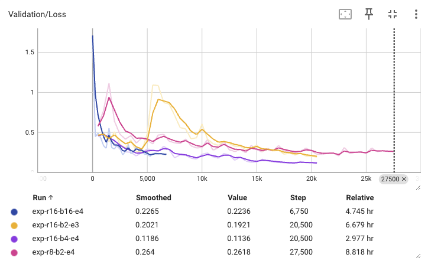
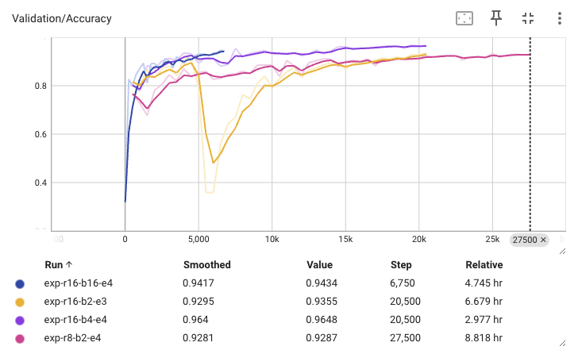

# News Lens LlaMA

## Which model(s) did you use?

I first evaluated the existing RoBERTa model, and then finetuned the LlaMA 3.2 1B model with QLoRA to perform the classification task hoping to capture longer input, better understand the news articles, and perform better classifications.

## For each model, what parameter settings are you using?

LlaMA 3.2 1B model with QLoRA

I tested the model with the following parameters:

1. rank 8 + batch size 2 + dropout 0.05 + epoch 4
2. rank 8 + batch size 2 + dropout 0.05 + epoch 3
3. rank 16 + batch size 2 + dropout 0.05 + epoch 3
4. rank 16 + batch size 16 + dropout 0.05 + epoch 4
5. rank 16 + batch size 4 + dropout 0.1 + epoch 3 (Best)

I used tensorboard to monitor the training process and evaluate the model.

## What is the model performance?

The best model achieved an accuracy of 0.96 on the validation set and 0.94 on the test set. As the labels are relatively balanced, accuracy is a good metric to evaluate the model. Nonetheless, I also evaluated the model F1 score, where the model achieved 0.95 on the test set.

The model generally did well in all the classes, with the lowest F1 score being 0.92 for the class "right". The Captum library was used to analyze the model's performance and it revealed that sometimes the model was confused with noise in the data, where the article supports some leftist view, but ultimately supports the right.

The model performed incredibly well on the test set, so I used MinHashLSH to find similar articles in the dataset to check for test set leakage (see `match_articles.py`). The model found just a dozen similar articles in the dataset, which suggests that the model did not memorize the test set and is actually generalizing well.

## Additional analysis

We also labeled a portion of the ground news 10k dataset with DeepSeek API. But only to find the deepseek labels in poor agreement with the LlaMA model. Two models had a cohen's kappa of 0.15, which is considered poor agreement. The LlaMA model was more skewed to the right in its labeling, and the deepseek model was more conservative.

More manual supervision must be done to investigate the disagreement between the two models. It could be because the inefficiency of the LlaMA model to capture the nuanced bias in the articles in ground news 10k, which contains various genres other than the training dataset, or the deepseek model is inherently biased and not capturing the bias correctly.

Additionally, an error analysis with Captum integrated gradients was performed to understand the model's decision-making process. The analysis revealed that the model was sometimes confused with noise in the data, where the article supports some leftist view, but ultimately supports the right. A model with more advanced reasoning capability or more parameters could potentially solve this issue.